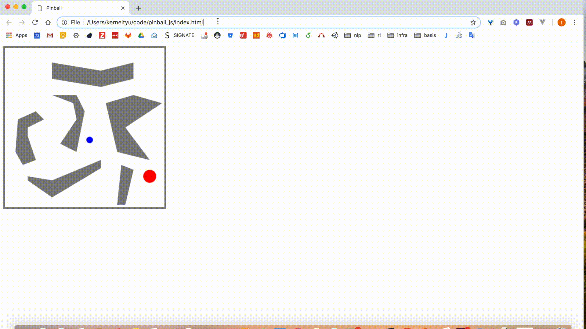

# pinball_js
This repository is for transform python code using open GL into javascript.
I aim to use the task for interactive ML on web.

## How to use
```
git clone 
cd pinball_js
open index.html
```
